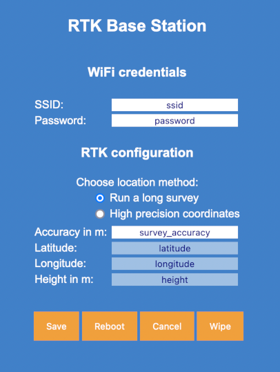

# RTKBaseManager
Configure ESP WiFi credentials and other default values for a RTK base station. It runs as an access point if no known SSID is found, after restart it is reachable as a client in your local network.
This is just the separate config project, what will be merged into the rtk-base project.

tbc..
