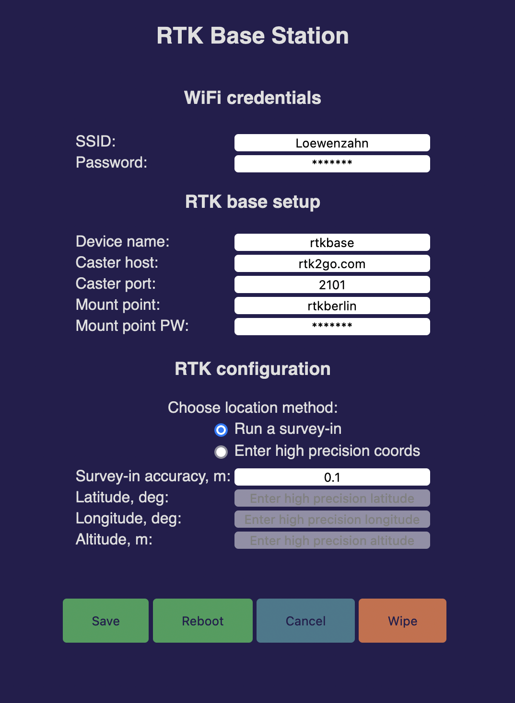

### RTKBaseManager

 

This is a submodule of the 
[Realtime Kinematics Base Station](https://github.com/audio-communication-group/RTKBaseStation).

Configure ESP WiFi credentials and other default values for a RTK rover. 
The device runs as an access point if no credentials are saved, (SSID: 
"rtkbase", IP: 192.168.4.1). 
Fill the web form with your data, save and reboot. 
After restart the device is reachable as a client in your local network ("rtkbase.local" or via local IP).

The mklittlefs file in the root dir you have to [get](https://github.com/earlephilhower/mklittlefs/releases) depending on your OS.
Or if you have Arduino IDE installed, you can borrow it from there. On macOS you can find it here: `~/Library/Arduino15/packages/esp32/tools/mklittlefs/3.0.0-gnu12-dc7f933/mklittlefs`.  Help for setup the file system you can find [here](https://randomnerdtutorials.com/esp8266-nodemcu-vs-code-platformio-littlefs/). This project was created on macOS (silicon).
