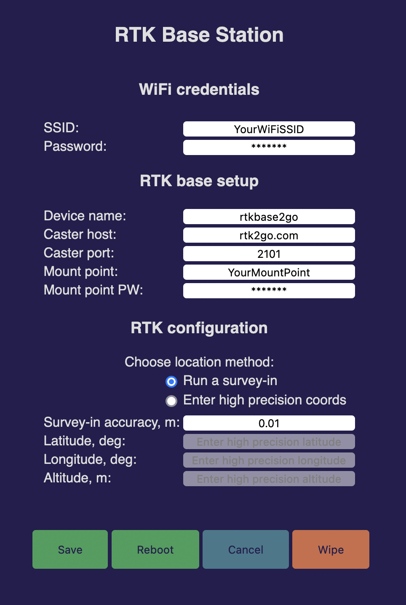

### RTKBaseManager

 

This is a submodule of the 
[Realtime Kinematics Base Station](https://github.com/audio-communication-group/RTKBaseStation).

Configure ESP WiFi credentials and other default values for a RTK rover. 
The device runs as an access point if no credentials are saved, (SSID: 
"rtkbase", IP: 192.168.4.1). 
Fill the web form with your data, save and reboot. 
After restart the device is reachable as a client in your local network ("rtkbase.local" or via local IP).

